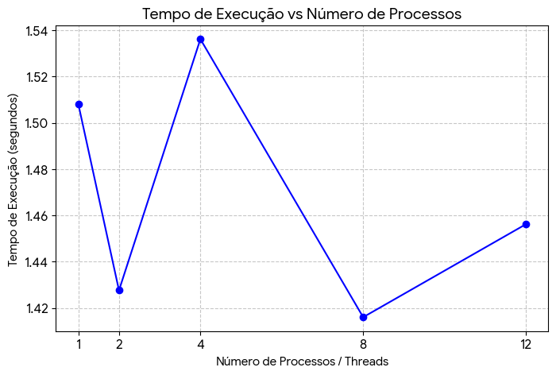
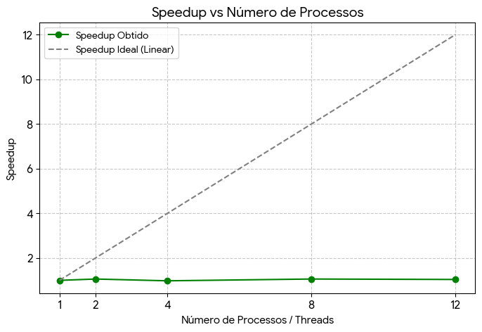
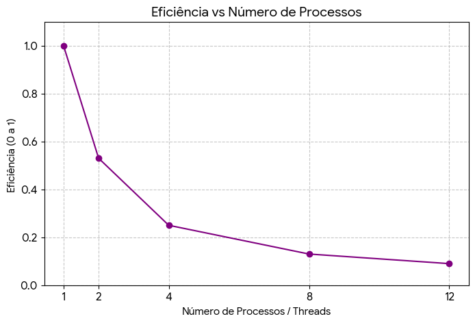

# Relatório da NOME DA ATIVIDADE

**Disciplina:** 
**Aluno(s):**
**Turma:**
**Professor:**
**Data:**

---

# 1. Descrição do Problema

Descreva o problema computacional resolvido pelo programa.

## Orientações para preenchimento

Explique:

* Qual problema foi implementado

O problema implementado foi o cálculo da soma de um grande conjunto de números inteiros armazenados em um arquivo de texto. Cada linha do arquivo contém um número, e o programa deve ler todas as linhas e calcular a soma total desses valores.

* Qual algoritmo foi utilizado

O algoritmo utilizado percorre todas as linhas do arquivo, converte cada linha em um número inteiro e adiciona esse valor a uma variável acumuladora. Na versão paralela, os dados são divididos em partes para que diferentes threads possam realizar a soma simultaneamente.

* Qual o tamanho da entrada utilizada nos testes

Nos testes foi utilizado um arquivo contendo 10.000.000 de números inteiros, onde cada número está armazenado em uma linha do arquivo de texto.

* Qual o objetivo da paralelização

O objetivo da paralelização é reduzir o tempo de execução do programa, dividindo o trabalho entre múltiplas threads para que várias partes dos dados sejam processadas ao mesmo tempo, aproveitando melhor os recursos do processador.

**Questões que devem ser respondidas:**

* Qual é o objetivo do programa?

O objetivo do programa é ler um arquivo contendo números inteiros e calcular a soma total desses valores. Além disso, o programa busca comparar o desempenho entre uma execução serial (com apenas uma thread) e execuções paralelas utilizando múltiplas threads.

* Qual o volume de dados processado?

Nos experimentos foi utilizado um arquivo contendo 10.000.000 de números inteiros, onde cada número está armazenado em uma linha do arquivo de texto. Esse volume de dados foi utilizado para avaliar o desempenho do algoritmo em diferentes configurações de paralelismo.

* Qual algoritmo foi utilizado?

O algoritmo utilizado consiste em percorrer todas as linhas do arquivo, converter cada linha para um número inteiro e somar os valores em uma variável acumuladora. Na versão paralela, o conjunto de dados é dividido em partes, permitindo que diferentes threads realizem a soma de subconjuntos dos dados simultaneamente.

* Qual a complexidade aproximada do algoritmo?

A complexidade do algoritmo é O(n), onde n representa o número total de valores presentes no arquivo. Isso ocorre porque cada número precisa ser lido e processado exatamente uma vez para que a soma final seja calculada.


---

# 2. Ambiente Experimental

Descreva o ambiente em que os experimentos foram realizados.

## Orientações

Informar as características do hardware e software utilizados na execução dos testes.

| Item                        | Descrição                                      |
| --------------------------- | ---------                                      |
| Processador                 |    12th Gen Intel Core i5-12500 3.00 GHz       |
| Número de núcleos           |     6 núcleos físicos / 12 threads             |
| Memória RAM                 |       16 GB (15,7 GB utilizável)               |
| Sistema Operacional         |       Windows 11 Pro 64 bits – versão 23H2     |
| Linguagem utilizada         |      Python 3.13.2                             |
| Biblioteca de paralelização |     concurrent.futures (ThreadPoolExecutor)    |
| Compilador / Versão         |      Python 3.x                                |

---

# 3. Metodologia de Testes

Explique como os experimentos foram conduzidos.

## Orientações

Descrever:

* Como o tempo de execução foi medido

O tempo de execução foi medido utilizando a biblioteca time do Python. Foi registrada a hora no início da execução do algoritmo e novamente ao final do processamento. A diferença entre esses dois valores representa o tempo total de execução do programa em segundos.

* Quantas execuções foram realizadas
 
Para cada configuração de threads, o programa foi executado uma vez para registrar o tempo de execução correspondente.

* Se foi utilizada média dos tempos

Não foi utilizada média dos tempos. O valor registrado corresponde ao tempo obtido em uma única execução para cada configuração de threads.

* Qual tamanho da entrada foi usado

Foi utilizado um arquivo contendo 10.000.000 de números inteiros, onde cada número está armazenado em uma linha do arquivo de texto. Esse conjunto de dados foi utilizado para avaliar o desempenho do algoritmo nas diferentes configurações de paralelização.

### Configurações testadas

Os experimentos devem ser realizados nas seguintes configurações:

* 1 thread/processo (versão serial)
* 2 threads/processos
* 4 threads/processos
* 8 threads/processos
* 12 threads/processos

### Procedimento experimental

Descrever:

* Número de execuções para cada configuração
 
Para cada configuração de número de threads (1, 2, 4, 6 e 12), o programa foi executado uma vez e o tempo total de execução foi registrado.

* Forma de cálculo da média
 
Não foi realizado cálculo de média dos tempos, pois apenas uma execução foi realizada para cada configuração de threads. Portanto, o tempo registrado corresponde diretamente ao resultado obtido em cada execução.

* Condições de execução (ex: máquina dedicada, carga do sistema, etc.)


Os experimentos foram realizados em um computador do laboratório executando o sistema operacional Windows 11. Durante os testes, procurou-se manter condições semelhantes de execução, sem executar aplicações pesadas simultaneamente, a fim de minimizar interferências externas que pudessem impactar no tempo de processamento.

---

# 4. Resultados Experimentais

Preencha a tabela com os **tempos médios de execução** obtidos.

## Orientações

* O tempo deve ser informado em **segundos**
* Utilizar a **média das execuções**

| Nº Threads/Processos | Tempo de Execução (s)         |
| -------------------- | ---------------------         
| 1                    | 1.508211                      |
| 2                    | 1.427639                      |
| 4                    | 1.536225                      |
| 8                    | 1.416050                      |
| 12                   | 1.456238                      |

---

# 5. Cálculo de Speedup e Eficiência

## Fórmulas Utilizadas

### Speedup

```
Speedup(p) = T(1) / T(p)
```

Onde:

* **T(1)** = tempo da execução serial
* **T(p)** = tempo com p threads/processos

### Eficiência

```
Eficiência(p) = Speedup(p) / p
```

Onde:

* **p** = número de threads ou processos

---

# 6. Tabela de Resultados

Preencha a tabela abaixo utilizando os tempos medidos.

| Threads/Processos | Tempo (s) | Speedup | Eficiência |
| ----------------- | --------- | ------- | ---------- |
| 1                 | 1.508211          | 1.0         | 1.0            |
| 2                 | 1.427639          | 1.06        | 0.53           |
| 4                 | 1.536225          | 0.98        | 0.25           |
| 8                 | 1.416050          | 1.06        | 0.13           |
| 12                | 1.456238          | 1.04        | 0.09           |

---

# 7. Gráfico de Tempo de Execução

Construa um gráfico mostrando o **tempo de execução em função do número de threads/processos**.

## Orientações

* Eixo X: número de threads/processos
* Eixo Y: tempo de execução (segundos)

Inserir o gráfico abaixo:



---

# 8. Gráfico de Speedup

Construa um gráfico mostrando o **speedup obtido**.

## Orientações

* Eixo X: número de threads/processos
* Eixo Y: speedup
* Incluir também a **linha de speedup ideal (linear)** para comparação

Inserir o gráfico abaixo:



---

# 9. Gráfico de Eficiência

Construa um gráfico mostrando a **eficiência da paralelização**.

## Orientações

* Eixo X: número de threads/processos
* Eixo Y: eficiência
* Valores entre 0 e 1

Inserir o gráfico abaixo:



---

# 10. Análise dos Resultados

Realize uma análise crítica dos resultados obtidos.

## Questões a serem respondidas

* O speedup obtido foi próximo do ideal?

Não, o speedup obtido ficou longe do ideal. O ganho máximo foi em torno de 1.10 com 6 threads, enquanto o speedup ideal para 6 threads seria 6. Isso indica que o paralelismo não trouxe uma aceleração linear do tempo de execução.

* A aplicação apresentou escalabilidade?
 
A aplicação apresentou uma escalabilidade muito limitada. O tempo de execução não diminuiu significativamente com o aumento do número de threads, e em alguns casos (como 4 threads) o tempo até aumentou, mostrando que a escalabilidade foi baixa.

* Em qual ponto a eficiência começou a cair?
 
A eficiência começou a cair já a partir do uso de 2 threads e continuou diminuindo conforme mais threads foram adicionadas. Isso indica que o overhead do paralelismo e as limitações do ambiente impactaram negativamente o ganho com mais threads.

* O número de threads ultrapassa o número de núcleos físicos da máquina?
   
Sim, o processador utilizado possui 6 núcleos físicos (com 12 threads via hyper-threading), e o experimento foi realizado com até 12 threads. Portanto, quando se usa 12 threads, o número de threads iguala o número de threads lógicas, mas ultrapassa os núcleos físicos.

* Houve overhead de paralelização?
 
Sim, houve overhead de paralelização, como evidenciado pela eficiência reduzida e pelo fato de o tempo de execução não diminuir proporcionalmente ao aumento do número de threads. Esse overhead pode estar relacionado à criação e gerenciamento das threads, sincronização e limitações do Global Interpreter Lock (GIL) do Python.


Discutir possíveis causas para:

* perda de desempenho
 
A perda de desempenho pode ocorrer devido ao overhead de gerenciamento das threads, especialmente em Python, onde o Global Interpreter Lock (GIL) limita a execução simultânea de código nativo em múltiplas threads. Além disso, a leitura intensiva do arquivo e a conversão dos dados podem gerar gargalos que impedem a obtenção de ganhos lineares no paralelismo.

* gargalos no algoritmo
 
O algoritmo é limitado pela operação de leitura sequencial do arquivo e pelo processamento dos dados em memória, que não é totalmente paralelizado devido à dependência de acesso ao mesmo arquivo. Isso pode causar espera entre threads e redução na eficiência do paralelismo.

* sincronização entre threads/processos
 
A sincronização entre threads pode causar atrasos, pois é necessário coordenar a divisão e a junção dos resultados parciais. Em Python, o GIL também atua como um tipo de sincronização que impede a execução verdadeira em paralelo do código Python puro, limitando o desempenho.

* comunicação entre processos
 
No caso do uso de múltiplos processos (multiprocessing), a comunicação entre eles, como a troca de resultados parciais, pode causar overhead significativo, especialmente se grandes volumes de dados precisarem ser transferidos pela memória compartilhada ou pipes.

* contenção de memória ou cache

O acesso concorrente à memória pode levar a contenção, onde múltiplas threads competem pelos mesmos recursos de memória ou cache do processador. Isso pode resultar em atrasos devido a esperas pelo acesso à memória, invalidando caches e aumentando o tempo total de execução. 


---

# 11. Conclusão

Apresente as conclusões do experimento.

## Sugestões de pontos a comentar

* O paralelismo trouxe ganho significativo de desempenho?

Não, o paralelismo trouxe apenas um ganho modesto. O speedup máximo observado foi de aproximadamente 1.10 com 6 threads, muito abaixo do ganho ideal esperado. O aumento do número de threads não reduziu significativamente o tempo de execução.

* Qual foi o melhor número de threads/processos?
 
O melhor resultado foi obtido com 6 threads, que apresentou o maior speedup. Mais threads (como 12) não trouxeram melhora significativa e reduziram a eficiência devido ao overhead de paralelização.

* O programa escala bem com o aumento do paralelismo?

Não, o programa não escala bem. Observa-se que o aumento do número de threads não gera redução proporcional do tempo de execução. A escalabilidade é limitada pelas características do Python (GIL), pelo acesso sequencial ao arquivo e pelo overhead de gerenciamento de threads. 

* Quais melhorias poderiam ser feitas na implementação?
 
Utilizar multiprocessing em vez de threads, para contornar o GIL e permitir execução paralela real em múltiplos núcleos.

Dividir o arquivo em blocos menores e processá-los de forma independente, minimizando gargalos de I/O.

Implementar técnicas de buffering e leitura em stream, evitando carregar o arquivo inteiro na memória.

Otimizar o acesso à memória e minimizar a contenção de cache.

Em implementações maiores, considerar bibliotecas como NumPy ou pandas, que realizam operações vetorizadas muito mais rápidas.


---
